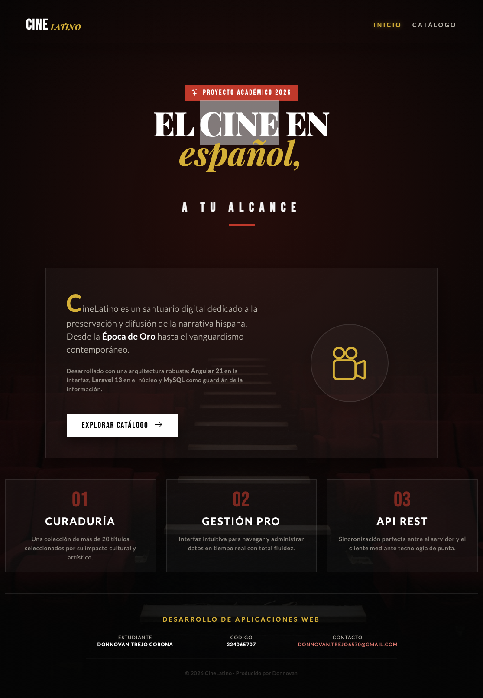
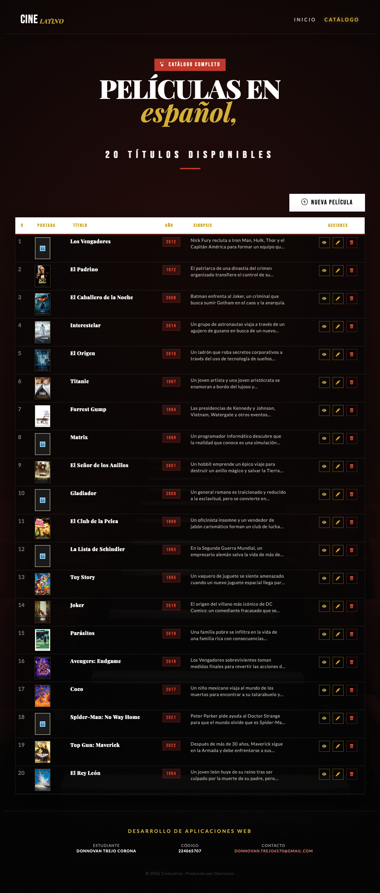
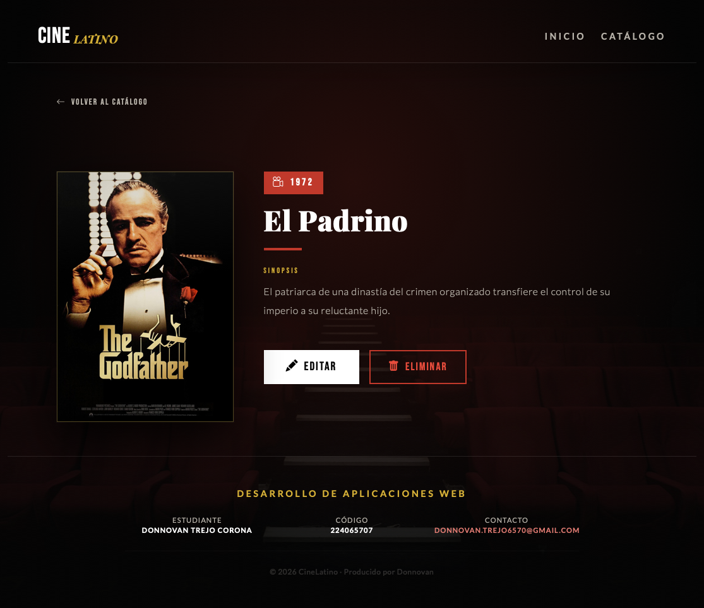
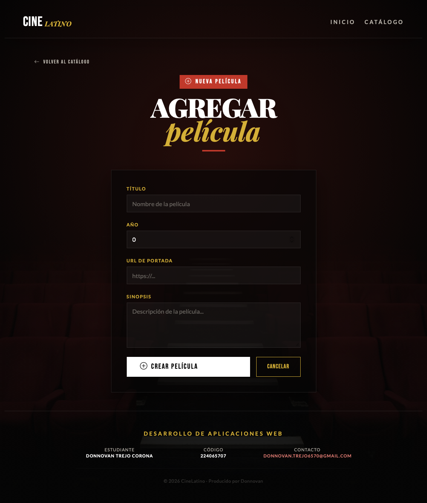
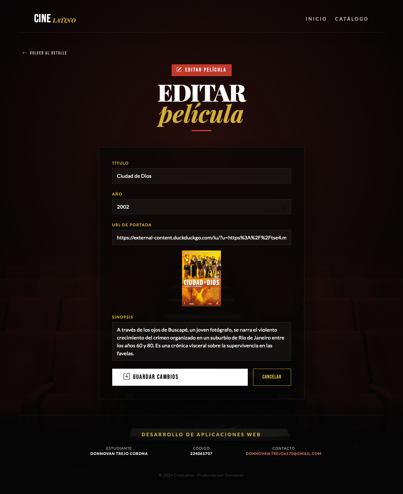

# CineLatino — Frontend

Interfaz de usuario desarrollada con Angular 21 para visualizar y gestionar
un catálogo de películas en español. Forma parte del proyecto académico CineLatino,
una aplicación web full-stack desarrollada para la materia de Desarrollo de Aplicaciones Web.

## Stack tecnológico

- **Angular** 21
- **Bootstrap** 5.3
- **Bootstrap Icons** 1.11
- **Google Fonts**: Playfair Display, Bebas Neue, Lato
- **TypeScript**

## Requisitos previos

- Node.js 25
- npm

## Instalación local

1. Clona el repositorio:
```bash
   git clone https://github.com/dnnnah/cine-latino-frontend.git
   cd cine-latino-frontend
```

2. Instala dependencias:
```bash
   npm install
```

3. Configura la URL del backend en `src/app/services/movie.ts`:
```typescript
   private apiUrl = 'http://127.0.0.1:8000/api/movies';
```

4. Inicia el servidor de desarrollo:
```bash
   ng serve
```

La aplicación corre en `http://localhost:4200`

## Vistas

| Ruta | Componente | Descripción |
|------|------------|-------------|
| `/` | HomeComponent | Página de inicio |
| `/catalogo` | MoviesComponent | Lista de películas |
| `/catalogo/agregar` | MovieCreateComponent | Agregar película |
| `/catalogo/editar/:id` | MovieEditComponent | Editar película |
| `/movie/:id` | MovieComponent | Detalle de película |

## Capturas de pantalla

### Inicio


### Catálogo


### Detalle de película


### Agregar película


### Editar película


## Estructura del proyecto

```
src/app/
├── components/
│   ├── movie/              # Detalle de película
│   │   ├── movie.ts
│   │   ├── movie.html
│   │   └── movie.css
│   ├── movies/             # Catálogo con tabla CRUD
│   │   ├── movies.ts
│   │   ├── movies.html
│   │   └── movies.css
│   ├── movie-create/       # Formulario agregar
│   │   ├── movie-create.ts
│   │   ├── movie-create.html
│   │   └── movie-create.css
│   └── movie-edit/         # Formulario editar
│       ├── movie-edit.ts
│       ├── movie-edit.html
│       └── movie-edit.css
├── pages/
│   └── home/               # Página de inicio
│       ├── home.ts
│       ├── home.html
│       └── home.css
├── services/
│   └── movie.ts            # Servicio HTTP con getAll, getOne, create, update, delete
├── app.routes.ts           # Rutas de la aplicación
├── app.config.ts           # Configuración HttpClient
└── styles.css              # Estilos globales y variables CSS
```

## Backend relacionado

Este frontend consume la API REST de CineLatino desarrollada en Laravel 13.

Repositorio backend: [cine-latino-backend](https://github.com/dnnnah/cine-latino-backend)

## Autor

| | |
|---|---|
| **Estudiante** | Donnovan Trejo Corona |
| **Código** | 224065707 |
| **Materia** | Desarrollo de Aplicaciones Web |
| **Año** | 2026 |
